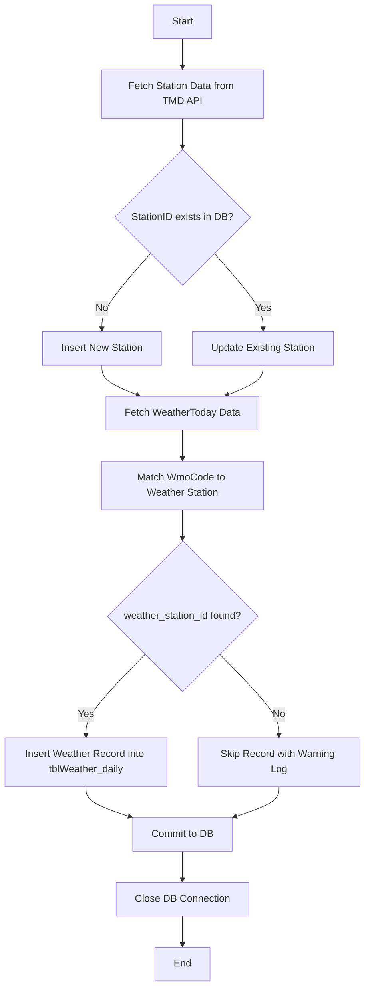

# 🌤️ TMD API to PostgreSQL ETL Pipeline

This project extracts weather station and current weather data from the Thai Meteorological Department (TMD) API, transforms the data, and loads it into a PostgreSQL database.

---

## 📌 Features

- Extracts **station** and **weatherToday** data from TMD API  
- Insert or Update logic for station data (`tblWeather_station`)  
- Inserts daily weather records into `tblWeather_daily`  
- Handles station lookup using `station_id` and `wmo_code`  
- Uses `.env` for managing sensitive configs  
- Built with `Python`, `requests`, `psycopg2`, `dotenv`

```text
Overall:
1. Load .env ➜ Connect to DB
2. Call TMD Station API ➜ Loop:
    ├── Check station_id:
    │     ├── If new ➜ INSERT
    │     └── If exists ➜ UPDATE
3. Call TMD Weather API ➜ Loop:
    ├── Find weather_station_id by wmo_code
    └── If found ➜ INSERT into tblWeather_daily
4. Close DB

```

---

## 📂 Project Structure

```text
root/
├── main.py         # Main ETL logic (Extract → Transform → Load)
├── .env            # API & DB credentials (excluded via .gitignore)
├── .gitignore      # Ignore sensitive and unnecessary files
├── station.json    # (optional) Sample station API response
├── weather.json    # (optional) Sample weatherToday API response
└── README.md       # Project overview and usage guide
```

---

## 🔄 ETL Flow Diagram




---

